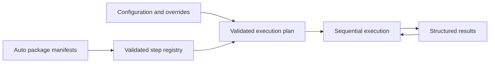

# Plot Manager runtime

The engine is domain-independent. Operators choose installed packages; plots connect concrete invocations; every invocation receives its own resolved settings.



## Runtime phases

1. Discover manifests and validate package IDs, step names, aliases, schemas, dependencies and module paths.
2. Import packages into module scopes and resolve their explicitly exported functions.
3. Resolve a named plot, build unique invocation IDs and validate the full static plan.
4. Resolve any preceding output references immediately before the consuming step.
5. Execute with an independent settings copy and a small execution context.
6. Stop at the first failure and return run/step statuses and outputs.

The output reference check cannot know a future runtime value's shape. A producer can succeed and a consuming step still fail validation; the result records that consuming invocation as failed. There is no automatic rollback, retry or parallel execution.

Use `Merge-PlotSettings` explicitly when assembling multiple configuration files through the module API. The CLI reads one complete configuration file, avoiding implicit dependence on historical settings.

## Module API

```powershell
Import-Module ./src/Deployment/Scripts/Core/PlotManager.psm1
$registry = New-PlotRegistry ./src/Deployment/Scripts/Auto
try {
    $configuration = Read-PlotConfiguration ./src/Deployment/Scripts/Examples/compose-files.json
    $result = Invoke-Plot -Registry $registry -Configuration $configuration -Plot compose-files -WorkDirectory ./plot-output
    if ($result.Status -eq 'Failed') { throw $result.Steps[-1].Error }
} finally {
    Remove-PlotRegistry $registry
}
```

Preflight errors throw without executing steps. Execution errors become structured Failed results. CLI maps either category to exit code 1. WhatIf or declined confirmation results are Skipped. No script-scoped Result or mutable global configuration is required by native packages.

## Compatibility boundary

Run.ps1 -Legacy starts Run-Legacy.ps1 in another PowerShell process. The historical AutoExt files, scripts and settings remain available there. A static Step-* collision check runs before loading those files.

The old start/stop helper scripts now call the standalone IIS package. They retain positional WebsiteName/AppPoolName parameters and process exit codes. IIS polling rereads current state on every iteration; start waits for the pool before the website, stop waits for the website before the pool. Missing resources and timeouts fail explicitly.

The old backup-all script's parse errors were repaired. Legacy environment overlays now distinguish missing properties from false/zero values and do not print old/new values. Other historical scripts retain their previous implementations. They are not claimed to be independently packaged, fully tested or generally portable by this refactor.

The previous unconnected Core-Helpers.ps1/System-Steps.ps1 prototypes have been replaced by the engine and IIS package; they are no longer competing function definitions.

The historical GUI/HTTP listener is not part of this runtime and has not been modernized. Existing caller integrations must choose the new CLI/API contract or explicitly use legacy mode.

## Validation

The dependency-free suite in tests covers real temporary-file composition, repeated calls, configuration isolation, module isolation, duplicate rejection, parameter/reference validation, dependency errors, CLI exit codes and IIS mocks. Real IIS, SQL Server, Docker, deployments and GUI are outside these tests.

No corporate repository code or configuration is required by the new engine or its native packages.
